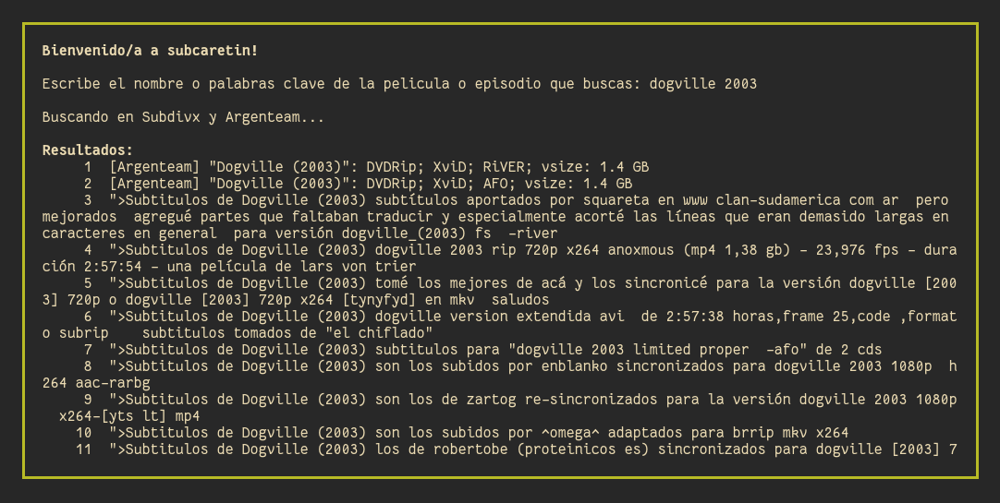

# subcaretin-manual

`subcaretin` busca, descarga, extrae, renombra y sincroniza subtítulos de Subdivx y Argenteam.

Nota: visita también [subcaretin-auto](https://github.com/vitiko123/subcaretin-auto)

### Demostración



## Características

* Búsqueda manual de subtítulos en Subdivx y Argenteam
* Decarga y extracción automática del subtítulo elegido para luego ser renombrado de acuerdo al archivo de vídeo referenciado
* Conversión automática de los subtítulos a UTF-8 para evitar problemas de compatibilidad
* Chequeo de integridad de subtítulos descargados
 
## Uso
```
chmod +x subcaretin
```
```
./subcaretin VIDEO.mkv
./subcaretin VIDEO.mp4
```

## Dependencias
### Obligatorio
* wget
* iconv
* unrar
* unzip

## Por hacer

* Hacer un port en Rust o Python

## Miscelánea

* Testeado en Arch Linux, Slackware, Debian Server y Ubuntu Server. ~~Puede que funcione en MAC OS~~. Habrán problemas con las flags de `grep` en MAC, pero se pueden resolver manualmente. Es muy probable que el script funcione en el subsistema de Linux en Windows 10
* Mi subdivx: https://www.subdivx.com/X9X2117299

## Changelog

### 0.1 - May 19 2020

- Lanzamiento inicial

### 0.2 - May 27 2020

- Soporte para Argenteam agregado

### 0.3 - Jul 03 2020

- Soporte para ffsubsync eliminado
